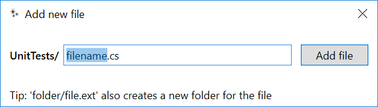

# FastNewFile
Visual Studio 2017 Extension for Adding a New File quickly.

This extension was forked from [Mads Kristensen's Add File](https://github.com/madskristensen/AddAnyFile) extension to support VS's build in templates. Since merging this repo,  the original extension seems to have evolved without continuing to support Visual Studio templates, I'm going to leave this fork unsynced with the original.

Due to this, this repo has additional features that the original extension does not; such as the suggesting a file extension when on the file name prompt. It may also be missing features that the current version of the original extension has as no attempt has been made to keep the extension current with the original code base.

### Features

##### Features Inherited From [AddAnyFile](https://github.com/madskristensen/AddAnyFile) 

- Easily create any file with any file extension
- Create files starting with a dot like `.gitignore`
- Create deeper folder structures easily if required
- Create folders when the entered name ends with a /
- Use `Shift+F2` keys to start creating a new file

##### Additional Features of FastNewFile

* Support for Visual Studio Templates (including custom templates)
* Customizable Pattern Matching for template selection 
  * e.g. `MyFile.cs` creates a C# Class, `IMyFile.cs` creates a C# Interface, `e:MyFile.cs` creates an empty C# code file.
* Defaults the extension (somewhat intelligently) based on the project. 
  * e.g. On a C# project, the extension will default to `.cs`, on VB, it will default to `.vb`. If you use a different extension twice consecutively, the extension then defaults to the 2nd extension. For example, on a project on which the default extension is `.cs`, if you create two `.ts` files consecutively, the next `Add new file` prompt defaults to `.ts`

